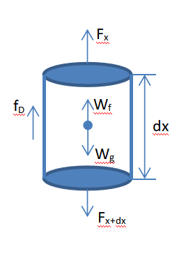

# 地下部分建模-示功图转泵功图

## 基础参数定义

- $$L$$：井深
- $$\rho_L$$：油管内液体密度
- $$N_c$$：抽油杆级联数目
- $$M_i$$：第$$i$$级抽油杆的离散化分段数目
- $$\rho_{ri}$$：第$$i$$级抽油杆的密度
- $$L_i$$：第$$i$$级抽油杆的长度$$L_i$$
- $$A_i$$：第$$i$$级抽油杆的横截面积
- $$E_i$$：第$$i$$级抽油杆的弹性模量

## 泵功图的基本计算方法

微元体下部轴向力$$F_{x+dx}$$

$$
F_{x+dx}=E_i\times A_i \times \frac{\partial u(x,t)}{\partial x}\bigg|_{x+dx}
$$

微元体上部轴向力$$F_x$$

$$
F_x=E_i\times A_i\times \frac{\partial u(x,t)}{\partial x}\bigg|_x
$$

微元体所受重力$$W_g$$

$$
W_g=\rho_{ri}g A_i dx_i
$$

微元体所受液体浮力$$W_f$$

$$
W_f=\rho_L g A_i dx_i
$$

微元体所受的粘滞阻力$$f_D$$

$$
f_D=K_i\times dx_i\times \frac{\partial u(x,t)}{\partial t}
$$

其中，$$u(x,t)$$为微元体在$$t$$时刻的位移。

根据牛顿第二定律，微元体所受的合力$$\Sigma F=ma$$（定义力向下方向为正）。即，

$$
F_{x+dx}-F_x+W_g-W_f-f_D=\rho_{ri}\times A_i\times dx_i\times \frac{\partial^2 u(x,t)}{\partial t^2}
$$

由此推导出波动方程为：

$$
\frac{\partial^2u(x,t)}{\partial t^2}=v^2\frac{\partial^2 u(x,t)}{\partial x^2}-c\frac{\partial u(x,t)}{\partial t}+\frac{\rho_r-\rho_L}{\rho_r}g
$$

其中，$$v=\sqrt{E/\rho_r}$$，阻尼系数$$c=K/(\rho_r A)$$

## 波动方程求解

当采用"Everitt-Jennings method"时，所关注的是相对有效负载，重浮力项可忽略。因此上述波动方程可简化为：
$$
\frac{\partial^2 u(x,t)}{\partial t^2}=v^2\frac{\partial^2 u(x,t)}{\partial x^2}-c\frac{\partial u(x,t)}{\partial t}
$$
通过求解该波动方程，即可根据所测得的地面功图数据推算出井下的泵功图。从而可以根据泵功图分析井下工况并采取相应的控制措施。

这里采用有限差分的方法来进行求解该波动方程。即，
$$
\begin{align}
\frac{\partial u(x,t)}{\partial t}&\approx\frac{u(x,t+\Delta t)-u(x,t)}{\Delta t} \\
\frac{\partial^2 u(x,t)}{\partial t^2}&\approx\frac{u(x,t+\Delta t)-2u(x,t)+u(x,t-\Delta t)}{\Delta t^2} \\
\frac{\partial^2 u(x,t)}{\partial x^2}&\approx\frac{u(x+\Delta x,t)-2u(x,t)+u(x-\Delta x,t)}{\Delta x^2} \\
\end{align}
$$
$$u(x_i,t_j)$$定义为第$$i$$个微元体在$$t_j$$时刻的位移，用$$u(i,j)$$来表示。则上述的波动方程离散化后为：
$$
u(i+1,j)=A_1\cdot u(i,j+1)+A_2\cdot u(i,j)+A_3\cdot u(i,j-1)+A_4\cdot u(i-1,j) \label{iter}
$$
其中，$$j=1,\cdots, N$$
$$
\begin{align}
A_1&=\frac{\alpha\cdot(1+c\Delta t)}{(EA/\Delta x)^+} \\
A_2&=\frac{-\alpha(2+c\Delta t)-(EA/\Delta x)^+-(EA/\Delta x)^-}{(EA/\Delta x)^+} \\
A_3&=\frac{\alpha}{(EA/\Delta x)^+} \\
A_4&=\frac{-(EA/\Delta x)^-}{(EA/\Delta x)^+}
\end{align}
$$
其中，
$$
\alpha=\frac{\overline{\Delta x}}{\Delta t^2}\left[ \frac{(\rho A)^++(\rho A)^-}{2} \right] \\
\overline{\Delta x}=[(\Delta x)^++(\Delta x)^-]/2
$$
注：

1. $$+/-$$表示在每个微元体下表面和上表面的参数值。当不同材质、不同截面积的抽油杆柱级联时，在抽油杆柱交界处需要区分上下部分的差异值。在均质杆柱内部迭代运算时，$$+/-$$的参数值一般是相等的。
2. 该有限差分式收敛的条件为$$\Delta x/(a\Delta t)\le 1$$

在均质杆柱的条件下，可化简为：
$$
\begin{align}
A_1&=\frac{\alpha\cdot(1+c\Delta t)}{(EA/\Delta x)} \\
A_2&=-\frac{\alpha(2+c\Delta t)-2(EA/\Delta x)}{(EA/\Delta x)} \\
A_3&=\frac{\alpha}{(EA/\Delta x)} \\
A_4&=-1
\end{align}
$$
其中，
$$
\alpha=\frac{\Delta x}{\Delta t^2}\rho A
$$

## 边界条件定义

1. 地面功图的位移$$X_i$$以下死点为位移的零点，位移方向向上为正。而波动方程杆柱的位移是以方向向下为正，因此波动方程中的边界条件$$u(0,j)=-X_i$$
2. 根据胡克定理，$$u(1,j)=f_{pr}(j)\Delta x/(EA)+u(0,j)$$
3. 由式$$\eqref{iter}$$可知，每一个新的节点的位移计算需要知道前面4个节点的位移信息。

但是对于$$j=1$$或者$$j=N$$的边界节点，需要增补$$j=0$$及$$j=N+1$$两列数据，否则无法迭代计算出$$j=1$$及$$j=N$$的边界节点的位移量。

那么如何增补$$j=0$$及$$j=N+1$$两列位移数据？依据功图周期性运行的特点，可通过如下等式定义来增补节点位移数据，
$$
u(i,0)=u(i,N) \\
u(i,N+1)=u(i,1)
$$

## 泵功图计算

依据式$$\eqref{iter}$$及上述边界条件，将$$u(i,j)$$从$$i=2$$到$$M$$进行迭代运算。随后迭代到pump处的公式如下：
$$
\begin{align}
u(\text{pump},j)=(1+D\Delta t)\cdot &u(M-1,j+1) \\
-D\Delta t \cdot &u(M-1,j+1) \\
+&u(M-1,j-1) \\
-&u(M-2,j)
\end{align}
$$
泵负载公式如下：
$$
F(\text{pump},j)=(\frac{EA}{2\Delta x})[3u(M,j)-4u(M-1,j)+u(M-2,j)]
$$

## 附录

下标：

- $$i$$：轴向距离（向下为正）
- $$j$$：时间
- $$m$$：泵节点

上标：

- $$+$$：研究小段的下表面
- $$-$$：研究小段的上表面
